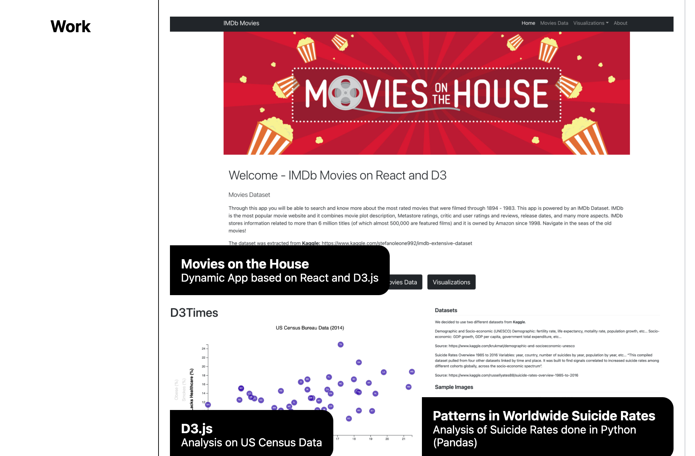

# Portfolio
Welcome to my portfolio repo! In this deployed app you will find a list of projects I have had the pleasure to work on on as well as brief information about me including a resume.

The app is responsive, uses flexbox and media queries to achieve optimal results on both mobile phones and desktops.

Link to the deployed application: https://richardguarnieri.github.io/advanced-css-portfolio/

## The Structure
The app is structured quite simply - you will find:
1. About Me
2. Work (Pprojects I have worked on)
3. Contact Me
4. Resume (opens a new tab with the .pdf file)
## App Image

*Brief look at the page*